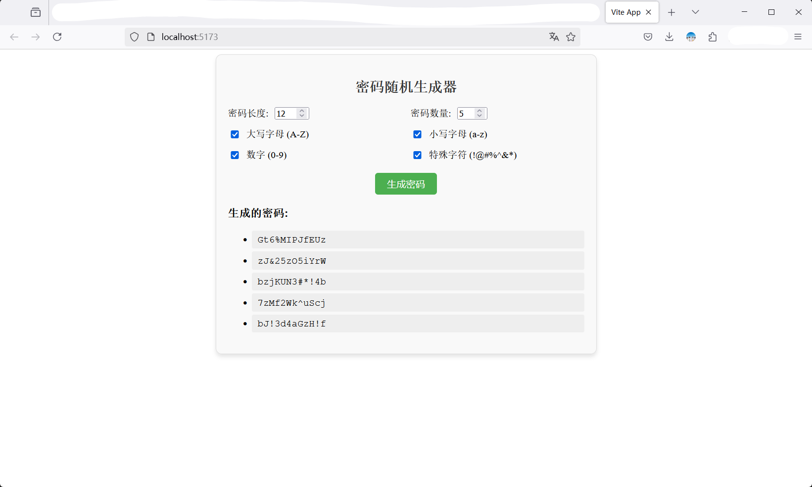

# GeneratePassword

## 项目简介

`GeneratePassword` 是一个用于生成安全随机密码的web应用。可以帮助用户创建强密码，以提高账户的安全性。



## 安装和使用

要启动开发服务器或运行应用，请执行以下命令：

```bash
pnpm i
pnpm run dev
```

启动应用程序，在本地主机上提供服务。

## 构建与测试

```bash
pnpm run build
pnpm serve
```


